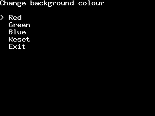

# deltabeard/menu

Simple and basic menu system written in C89.

Two examples can be found within the examples folder. Below is a
recording of an example interface created using SDL2, with menu.h
used to create and control the menu contexts.

## License

Released under the Zero Clause BSD license (SPDX: 0BSD).
